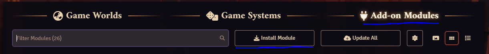

# Fantasy Town Generator Importer

Integrate [Fantasy Town Generator](https://www.fantasytowngenerator.com) settlements into Foundry Virtual Tabletop.

Only supported for [premium users](https://www.patreon.com/fantasytowngenerator).

Features:

* Import settlements from Fantasy Town Generator, with changes kept in sync.
* Imports the map, buildings, people, and factions.
* Update notes and favourites.
* Start events.
* Show players where they are on the map.
* Simulate the time of day.
* Link FTG entities to journal entries (with support for Monk's Enhanced Journals).
* Integration with simple-calendar.

## Examples

The map view:


Layers:


Buildings and people:


## Installation

### Option 1 (Preferred) - Download via Foundry

Using this option will allow you to download updates through foundry.
First, open FoundryVTT, and navigate to the 'Add-On Modules' view. Then, click the 'install module' button. In the '
Manifest URL' field, enter

```
https://raw.githubusercontent.com/thomasjallerton/towngenerator-foundrymodule/main/module.json
```

and then press install. Done!

Open the modules:


Enter the path to json:


### Option 2 - Manual download

Clone the project, and copy into your foundry modules folder. The structure should look like:

```
{userData}/Data/modules/  
    fantasy-town-generator-import/  
        module.json
        *
```

NOTE: Ensure that the folder name under `/modules/` is `fantasy-town-generator-import`, otherwise it won't show up in
Foundry.
You may have to rename the folder.

e.g. on my windows install it goes in the `%AppData%/Local/FoundryVTT/Data/modules` directory. More information
[here](https://foundryvtt.com/article/module-development/).

### Activate

Activate the module in FoundryVTT.

1. Activate your world and log in as a game master.
2. Go to the game settings, then manage modules.
3. Enable 'Fantasy Town Generator Importer'.
4. Save and reload.

## Importing a settlement

Ensure you have the module installed before doing this.

#### 0. Set the FoundryVTT allowed origins

In the premium settings, go to the Foundry VTT tab. Here you need to add the URL origin(s) that you use to access
Foundry. To determine what this origin is, open Foundry, and press the "Import from FTG" button on the Scenes menu. A
dialog will appear highlighting the origin:


Then, just add this to the list in the premium settings:


This step just needs to be done once. If you can see the map, but can't interact with anything, then that usually means
that this has been set incorrectly. Double-check the origin in foundry as described above.

#### 1. Allow public access for the settlement

For the players to see the settlement, you need to enable public access (any level is fine).

#### 2. Export from FTG

Press the Export to Foundry VTT button from the settlement:


If you've done the above steps, you'll see:


Press the copy to clipboard button.

#### 3. Import into Foundry VTT

Press the "Import from FTG" button on the Scenes menu. A dialog will appear - paste the copied import config into the
text area:


Press import, and a new scene will be created. When you navigate to this scene, you should see a fully interactable map.

## Journal Linking

You can link Fantasy Town Generator buildings, people, and factions to a journal entry. To do this, open up the dialog
for one of these, and then click the 'settings' button in the top right of the dialog. Note, only the GM has access to
the settings.


From here, drag and drop a journal entry onto the empty input (that says "Drop here"). You'll see something like:


There are a couple of other settings:

- Open at page
    - When the journal is opened, it will open at this page.
    - Not available if Monk's Enhanced Journals is active.
- Open automatically
    - When the FTG dialog is opened (e.g. when a building is clicked on the map, or a person clicked in a building), the
      journal entry will also be opened.

Once that's configured, a button to open the journal will appear in the entity dialog:


All players with access to the journal will see the journal button, and will have it open automatically if that option
is configured.

## Simple Calendar

If Simple Calendar is installed, the settlement will be simulated as the time changes in Simple Calendar. When the map
is loaded, it will sync to the current time in the calendar, and then will be kept in sync while the GM is looking at
the map. This includes the time jump features, as well as the realtime updates (though FTG will only simulate every hour
change, not minute or second).

A button appears in FTG that will let you open the calendar if it is currently closed:


When choosing what day should be simulated, FTG looks at the name of the day of the week in simple calendar, and will
then fall back to the index of the day of the week if no names match.

For example, if an FTG settlement is configured with the days of week:

- Monday, Tuesday, Wednesday, Thursday, Friday, Saturday, Sunday

and Simple Calendar has:

- Funday, Wonday, Tuesday, Wednesday, Thursday, Friday, Saturday, Sunday, Extraday

then if you set the date in Simple Calendar to:

- 'Tuesday', FTG will simulate this as a Tuesday.
- 'Wonday', FTG will simulate this as a Tuesday, as Wonday is the second day of the week.
- 'Extraday', FTG will be unhappy, and will simulate this as an unknown day (which usually means that everyone has a
  clear schedule, so they just relax).
