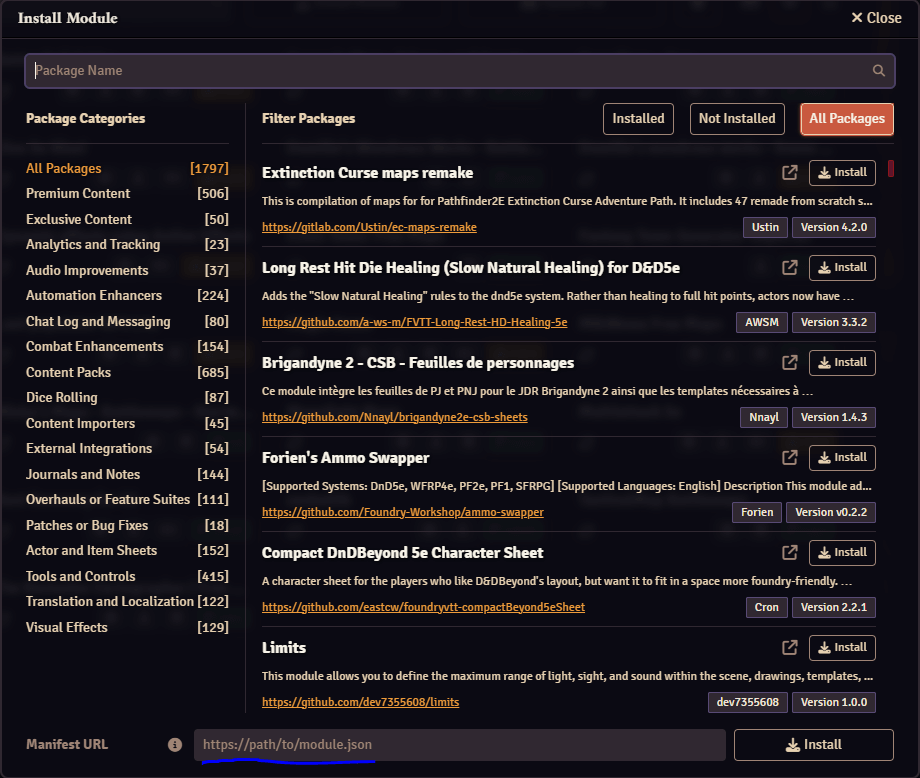

# Fantasy Town Generator Importer

Integrate [Fantasy Town Generator](https://www.fantasytowngenerator.com) settlements into Foundry Virtual Tabletop.

Only supported for [premium users](https://www.patreon.com/fantasytowngenerator). 

Features:
* Import settlements from Fantasy Town Generator, with changes kept in sync.
* Imports the map, buildings, people, and factions.
* Update notes and favourites.
* Start events.
* Show players where they are on the map.
* Simulate the time of day.

## Examples

The map view:


Layers:


Buildings and people:


## Installation

### Option 1 (Preferred) - Download via Foundry
Using this option will allow you to download updates through foundry.
First, open FoundryVTT, and navigate to the 'Add-On Modules' view. Then, click the 'install module' button. In the 'Manifest URL' field, enter
```
https://raw.githubusercontent.com/thomasjallerton/towngenerator-foundrymodule/main/module.json
```
and then press install. Done!

Open the modules:


Enter the path to json:



### Option 2 - Manual download
Clone the project, and copy into your foundry modules folder. The structure should look like:

```
{userData}/Data/modules/  
    fantasy-town-generator-import/  
        module.json
        *
```
NOTE: Ensure that the folder name under `/modules/` is `fantasy-town-generator-import`, otherwise it won't show up in Foundry.
You may have to rename the folder.

e.g. on my windows install it goes in the `%AppData%/Local/FoundryVTT/Data/modules` directory. More information
[here](https://foundryvtt.com/article/module-development/).

### Activate

Activate the module in FoundryVTT.
1. Activate your world and log in as a game master.
2. Go to the game settings, then manage modules.
3. Enable 'Fantasy Town Generator Importer'.
4. Save and reload.

## Export and Import

### Fantasy Town Generator Prerequisites

1. Be a premium user.
2. Go to your premium settings.
3. Select the Foundry VTT tab.
4. Add the HTTP origin you use to connect to Foundry VTT. If you run Foundry locally,
this is probably `http://localhost:30000`.

### Export a settlement

1. Navigate to the settlement you want to export in [Fantasy Town Generator](https://www.fantasytowngenerator.com).
2. Ensure the settlement supports public access (if you want your players to be able to see the map in Foundry),
edit this in the settlement specific settings (settings cog above settlement name -> settlement specific settings).
3. Press the download button above the settlement name.
4. Select 'Export to FoundryVTT'
5. Copy the export code to your clipboard.

### Import a settlement

1. Open your world in Foundry with the module active as the game master.
2. Navigate to the 'Scenes' tab.
3. Click 'Import from FTG'.
4. Paste the code copied in the previous step.
5. This will have created a new scene (or check the Foundry console for errors)
6. Like normal, selecting 'View scene' will open it only for you, and 'Activate' will open it for your players.
7. Once either of those are pressed, you may be prompted to sign in - do so (your players won't see this &
don't need an account).
8. Done!

